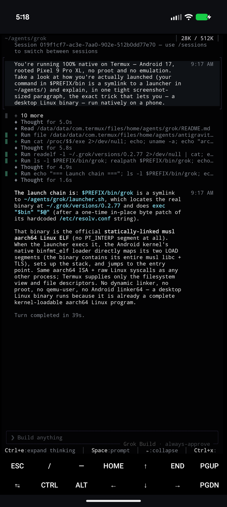

# grok-cli-termux-native

Run **xAI's Grok Build CLI (`grok`) natively on Termux** (Android · aarch64) — **no proot, no reboot** (and **no root** required).

Grok Build ships a **statically-linked musl** aarch64 binary — no interpreter, no glibc — so it runs directly on the kernel and bundles its own TLS roots. It boots native on Termux out of the box. The **only** thing that fails is DNS: musl reads `/etc/resolv.conf`, which can't exist on stock Termux (`/etc → /system/etc`, read-only), and a *static* binary ignores `LD_PRELOAD` so a preload shim can't help either.

## Demo — Grok explaining its own install

Asked how it's running, Grok inspects its own launcher + binary on-device (Android 17, Pixel 9 Pro XL) and explains why a static musl ELF just runs — the kernel's `binfmt_elf` loader maps it directly, no dynamic linker, no proot, no qemu:



## The fix: one 16-byte patch (no root)

There is exactly **one** hardcoded `/etc/resolv.conf` string in the binary. `/sdcard/.grokdns` is also exactly 16 bytes, so we swap them **in place** — no length change, no relocation — and drop a resolv file there:

```
/etc/resolv.conf   →   /sdcard/.grokdns      (nameserver 8.8.8.8 / 8.8.4.4)
```

Now musl resolves DNS from a file Termux *can* write, with **zero root and zero proot**. (`/sdcard` is the only short, app-readable path that fits in 16 bytes.)

> HTTPS already works — Grok bundles its CA roots. Only DNS needed fixing.

### Rooted? The launcher uses the cleaner path automatically

If you're rooted (Magisk/APatch), a systemless module can supply a real `/etc/resolv.conf` (since `/etc → /system/etc`). When the launcher sees one, it **keeps the binary pristine** and lets musl resolve natively — **no byte-patch at all**. No-root and rooted are the same install; `grok-dns.py` swaps the path either direction and only writes on a real change, so it self-corrects if you move between setups or a self-update resets the string.

## Requirements

- Termux on **aarch64 / arm64**, with storage access (`termux-setup-storage`)
- Internet on first run

## Install

```bash
git clone https://github.com/Thr45hx/grok-cli-termux-native
cd grok-cli-termux-native
bash install.sh
```

or one-shot:

```bash
curl -fsSL https://raw.githubusercontent.com/Thr45hx/grok-cli-termux-native/main/install.sh | bash
```

Then authenticate and go:

```bash
export XAI_API_KEY=xai-...        # or just run `grok` for the browser "Sign in with Grok" flow
grok -p "hello from native Termux"
```

## Updates just work (Ctrl+U)

Grok's own updater (Ctrl+U, or `grok update`) downloads the new binary to `~/.grok/downloads/` and marks it current by repointing `~/.grok/bin/grok` at it — but it **never** touches the `versions/` store that a wrapper launcher runs from. On a naive setup that means the update downloads but never applies: you restart and you're still on the old version.

This launcher closes that gap. On each start it resolves `~/.grok/bin/grok`, reads the version from the filename, and **promotes** it into `~/.grok/versions/` + repoints `.verified`. So after Ctrl+U, just restart grok once and you're on the new build.

It also re-applies the DNS fix per version (a fresh download restores the original `/etc/resolv.conf` string) and re-seeds `/sdcard/.grokdns` if it goes missing.

## Layout

```
~/.grok/versions/<ver>          # grok binary (pristine, or byte-patched for no-root)
~/.grok/bin/grok                # grok's own "current" symlink (the launcher adopts it)
~/agents/grok/
├── launcher.sh                 # ← $PREFIX/bin/grok symlinks here
└── grok-dns.py                 # bidirectional 16-byte DNS-path swap (native ⇄ sdcard)
/sdcard/.grokdns                # nameserver 8.8.8.8 / 8.8.4.4 (no-root mode only)
```

## Uninstall

```bash
bash uninstall.sh
```

## Part of the native-Termux CLI family

One-command **native, no-proot** installers for AI coding CLIs on Termux — same toolkit, one per agent:

- [claude-code-termux-native](https://github.com/Thr45hx/claude-code-termux-native) — Claude Code
- [antigravity-cli-termux-native](https://github.com/Thr45hx/antigravity-cli-termux-native) — Google Antigravity
- [grok-cli-termux-native](https://github.com/Thr45hx/grok-cli-termux-native) — xAI Grok Build
- [opencode-termux-native](https://github.com/Thr45hx/opencode-termux-native) — OpenCode
- [copilot-cli-termux-native](https://github.com/Thr45hx/copilot-cli-termux-native) — GitHub Copilot

## Notes

- **AI-assisted:** built and reverse-engineered with AI help — a daily-driver, not a toy. Provided as-is.
- **Tested on:** Android 17, rooted **Pixel 9 Pro XL** (Tensor G4, aarch64).
- **Root / no-root:** **No root needed** by default (sdcard byte-patch); rooted users get the pristine binary automatically via a systemless resolv module. Same install either way.
- **License:** [MIT](./LICENSE).

---

Unofficial — not affiliated with xAI. Provided as-is, no warranty.
